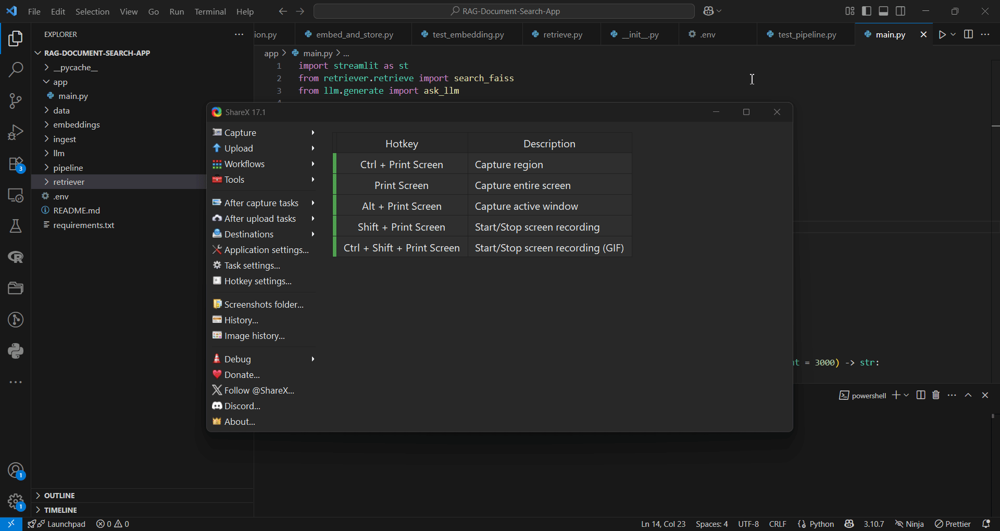

# 🧠 RAG Document Search App

A full-stack **Retrieval-Augmented Generation (RAG)** pipeline that ingests documents (PDFs, TXT), indexes them into a vector store, and allows users to query those documents through a language model-powered interface.

---


🗓️ Project Timeline

Originally Started: March 2024

Finalized: May 2024

Portfolio Update: July 2025

---


## 🔹 Demo

Here’s a quick walkthrough of the app in action:



---


## 🚀 Features

- 📥 Upload `.pdf` and `.txt` files from your local system
- ✂️ Automatic document chunking
- 🔍 Embedding with `sentence-transformers` or OpenAI
- 🧠 Vector storage using `FAISS`
- 🤖 OpenAI GPT-3.5 or GPT-4 powered Q&A
- 🌐 Simple UI with Streamlit

---

## 🛠️ Tech Stack

| Component         | Tool                         |
|------------------|------------------------------|
| Chunking         | Custom, via word splitter    |
| Embeddings       | `sentence-transformers` / OpenAI |
| Vector DB        | `FAISS`                      |
| LLM Inference    | `OpenAI GPT-3.5` / `GPT-4`   |
| Frontend         | `Streamlit`                  |
| PDF Parsing      | `PyMuPDF`                    |
| API Key Handling | `python-dotenv`              |

---

## 📁 Folder Structure

```bash
rag-document-search-app/
├── data/                      # Raw documents (PDFs, TXTs)
├── ingest/                    # Loading and chunking logic
│   ├── __init__.py
│   ├── loaders.py
│   └── chunking.py
├── embeddings/                # Embedding generation and vector store
│   ├── __init__.py
│   └── embed_and_store.py
├── retriever/                 # Query handling and retrieval
│   ├── __init__.py
│   └── retrieve.py
├── llm/                       # Prompt formatting and LLM response
│   ├── __init__.py
│   └── generate.py
├── app/                       # Streamlit frontend
│   ├── __init__.py
│   └── main.py
├── requirements.txt
├── README.md
└── .env                       # Contains your OpenAI API key


## 🛠️ **Setup Instructions**

Follow the steps below to run the RAG document search app locally.

---

### 📁 **Step 1: Clone the Repo**

```bash
git clone https://github.com/YOUR_USERNAME/Deep-Learning---Project-1
cd Deep-Learning---Project-1
```

---

### 📦 **Step 2: Install Dependencies**

```bash
pip install -r requirements.txt
```

---

### 🔐 **Step 3: Add Your OpenAI Key**

Create a `.env` file in the root folder and add:

```env
OPENAI_API_KEY=sk-xxxxxxxxxxxxxxxxxxxx
```

---

### ▶️ **Step 4: Run the App**

```bash
streamlit run app/main.py
```

## 📘 Sample Q&A Results

Below are sample interactions demonstrating the RAG system's document-based responses.

---

### 🗂️ Source: *"Attention Is All You Need"*

> **Q:** What are transformers used for in NLP?  
> **A:** Transformers are deep learning models that learn contextual relationships in sequences of data.

> **Q:** What is self-attention?  
> **A:** Self-attention is a mechanism that lets each word in a sentence consider other words to understand context.

---

### 📄 Source: *"A Comprehensive Survey of NLP"*

> **Q:** What are the major tasks in NLP covered?  
> **A:** The survey covers a wide range of NLP tasks such as POS tagging, parsing, translation, summarization, etc.

> **Q:** What are some challenges in current NLP systems?  
> **A:** Key challenges include ambiguity, data sparsity, and limited world knowledge.


